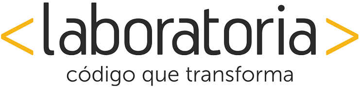
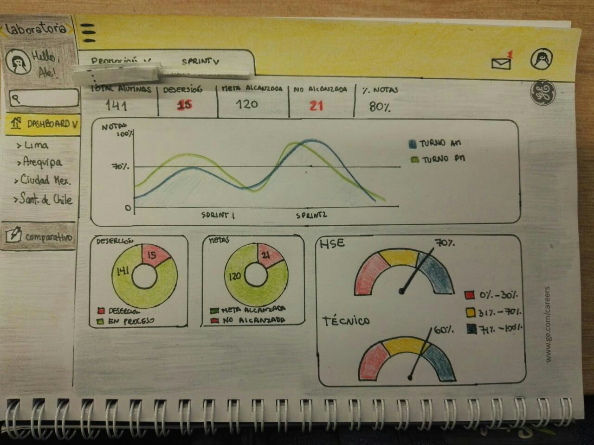
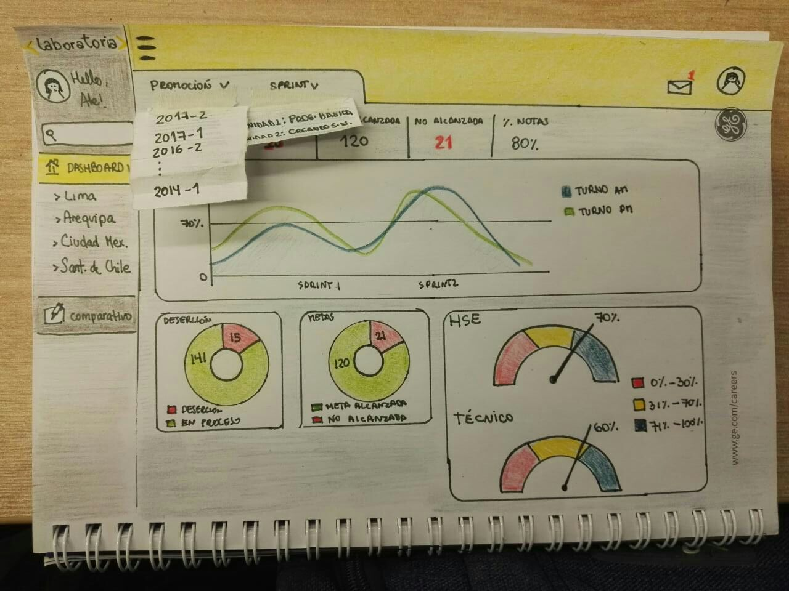

#3. Crea un sketch para la herramienta del dashboard de Laboratoria

###Entrevista

La primera fase de la creación de nuestro Sketch para el Dashboard fue la entrevista a **Alejandra Ramirez**, ya que ella sería la usuaria de la plataforma.


En las preguntas que se realizaron notamos las siguientes necesidades principales:

* Facilidad para elegir la sede, promoción y sprint.
* Visualizar el avance de la clase por sprint.
* Porcentaje (%) y cantidad (#) de alumnas que superaron, o no, la media de 70%
* Separar las notas por HSE y Técnico; y además mostrar un global.
* Medir la cantidad de alumnas que desertaron.
* Colores que respeten la línea gráfica de laboratoria.
* Comparativos por turnos y promoción.
* Leyendas

###Sketch

Se realiza el primer boceto a mano alzada del dashboard, se puede apreciar la pantalla general que tendría por default Lima ya que estaría dentro del perfil de Alejandra.




###Modificaciones al Sketch

Al mostrar el primer sketch a nuestra usuaria, nos dió algunas observaciones adicionales:

1. Separar los datos del total de alumnas y la deserción de la meta alcanzada y no alcanzada.
2. Modificar el nombre de "% de Notas" por "Promedio".
3. Cambiar los rangos de las leyendas HSE y Técnico.

Teniendo en cuenta sus necesidades, el sketch se modificó de la siguiente manera: 


Una de las cosas que podemos incluir es código:
`<?php echo "Hola Mundo"; ?>`
O incluir el nombre del lenguage de programación:
```[javascript]
// Esto sería código Javascript
```

*Esto es un texto en cursiva, que también incluye otro ** en el propio texto **

###**Alumna**

>#####Stephanie Wong Vega

